<div align="center">

# 🛒 Discern

### Find the *genuinely best* product for a specific person — not whatever ranks highest or pays the most commission.

[](LICENSE)
[](package.json)
[](viewer/go.mod)
[](tools/test-logic.mjs)
[](#status--roadmap)

</div>

---

Discern is a cross-platform **agentic-commerce skill** that runs a disciplined human buying method. It harvests
many sources, collapses affiliate/SEO echo into a **single** signal, tears down the fundamentals, applies *your*
preferences and a value-over-price gate, and emits a structured **Recommendation Object** carrying provenance,
per-claim confidence, counterevidence, and an explicit outcome:

> `RECOMMEND` · `RECOMMEND_WITH_CAVEATS` · `INSUFFICIENT_EVIDENCE`

It would rather say *"not enough evidence"* than launder a guess. The method, schemas, and a sequential
web-search/fetch path are a **portable core** that runs in any AI runtime; parallel subagents, browser
automation, and retailer APIs are optional boosters that widen breadth and speed where available — never hard
dependencies.

## The method

```mermaid
flowchart LR
  A["1 · Frame<br/>need + beneficiary"] --> B["2 · Triage<br/>research depth"]
  B --> C["3 · Harvest<br/>many sources"]
  C --> D["4 · Cluster<br/>echo = one signal"]
  D --> E["5 · Teardown<br/>fundamentals"]
  E --> F["6 · Value &<br/>preference filter"]
  F --> G["7 · Price/value<br/>gate (last)"]
  G --> H["8 · Source<br/>best offer"]
  H --> R{{"Recommendation<br/>Object"}}
  R --> S[("Durable store")]
  S --> V["Go TUI viewer"]
```



## Why it's different

Most shopping tools rank by price or star rating and have no taste. Discern encodes a real method:

- **Independence over volume.** Syndicated/affiliate listicles that copy each other count as **one** signal, not
  many — visibility can't masquerade as quality (union-find independence clustering, affiliate down-weighting).
- **Substance over marketing.** A teardown step weighs chips, materials, and genuine value propositions, not spin.
- **Value ≠ price ≠ markup.** Handmade/local *is* value; "good enough" can beat "best." The price gate is applied
  **last**, on value-per-dollar.
- **Hard filters bite, structurally.** A dealbreaker (e.g. *"natural materials only"*, *"must have LDAC"*) marks the
  offending option `DISQUALIFIED — dealbreaker` in the grid and removes it from contention — it can never win on
  fundamentals alone.
- **Explicit, calibrated outcomes.** Every recommendation states an outcome, per-claim/per-offer confidence on a
  0..1 scale, counterevidence, and a failed-source log. Scraped prices are flagged *verify-at-checkout*.
- **You + a gift switch.** A persistent preference profile, with a beneficiary switch (self vs. recipient) that
  swaps the active filters and value framework.

## Quickstart

```bash
git clone https://github.com/gtm-k/discern.git && cd discern

# 1) Node tools + offline gate
npm install
npm test                                   # validates schemas + all golden/eval fixtures

# 2) Build the viewer (Go)
cd viewer && go build -o discern-view . && cd ..

# 3) See it immediately on the bundled example run
viewer/discern-view --store store/example  # ↑/↓ navigate · Enter open · / filter · q quit

# 4) Run a real recommendation: open your AI runtime in this repo and point it at the skill —
#    "Follow skills/discern/SKILL.md to recommend <need> for me (profiles/self.md)."
```

> Set up your private profile first: `cp profiles/self.example.md profiles/self.md` and edit it.
> Real profiles and live run history are git-ignored; only `*.example.md` and `store/example/` ship.

## Example output

A real run, rendered (`store/example/`):

```text
# Discern recommendation
**Outcome:** RECOMMEND  ·  **Overall confidence:** high (0.82)

## Pick — Sony WH-1000XM5 by Sony
Recurs across the most independent clusters AND leads on fundamentals (ANC processor, comfort, multipoint).
**Value:** Best value-per-dollar at ~$300 (value-per-dollar: high)

## The grid (ranked by fundamentals, then independent recurrence)
1. Sony WH-1000XM5 by Sony — fundamentals 0.86 · independent clusters 2
   - counterevidence (defect): Non-folding hinge reduces packability [ReviewOutletA]
2. Bose QuietComfort Ultra by Bose — fundamentals 0.82 · independent clusters 1

## Offers (where to buy)
- ExampleStore — 298 USD · provenance: fetch · confidence: moderate (0.60) · ⚠ verify at checkout

## Search universe
Angles swept: roundup, requirement, community   ·   Tiers unavailable: browser, api   ·   Fetches used: 7
```

## The Recommendation Object

The stable contract across every phase (`schemas/recommendation-object.schema.json`). One run object carries:
framed requirements + beneficiary, candidates with per-evidence **provenance** and source-independence clusters,
a fundamentals shortlist, per-claim/per-offer **confidence**, **counterevidence** (incl. typed `recall` /
`dealbreaker`), durable product IDs, a failed-source log, the chosen **pick** + outcome + `reason_code`, and a
`search_universe` (queries, tiers, budgets, **angles swept**). Later phases consume the *same* object to prep
checkout and, eventually, to buy via agentic-commerce rails.

## Durable run store + TUI viewer

Every completed run can be persisted and browsed locally.

- **Writer** (`tools/store.mjs`, Node) — validates the object, renders it via the single renderer
  (`tools/render.mjs`), and writes `store/runs/<id>.{json,md}` plus a navigable `index.json`. It refuses to store
  a malformed object.
- **Viewer** (`viewer/`, Go + [Bubble Tea](https://github.com/charmbracelet/bubbletea)) — a single binary that
  lists, filters, and reads runs. It only *displays* the pre-rendered Markdown (no rendering logic is duplicated in
  Go), and treats a shared/hand-edited store as untrusted (rejects path-escaping report references).

```bash
node tools/store.mjs record <rec.json>     # archive a run   ·   reindex rebuilds the index
viewer/discern-view --store store          # browse the live store
```

See [`docs/store.md`](docs/store.md) for the layout, id scheme, and index contract.

## Repository layout

| Path | What |
|------|------|
| `skills/discern/SKILL.md` | The buying method — the portable skill |
| `schemas/` | Recommendation Object · Preference Profile · subagent-output · store-index JSON Schemas (the contracts) |
| `docs/` | `triage`, `definitions`, `data-access`, `render`, `category-widening`, `live-smoke`, `store` — the normative specs |
| `tools/` | Node ESM: `validate`, `cluster`, `grid`, `decision`, `render`, `coverage`, `orchestration`, `category-gate`, `store` |
| `agents/` | Capability-gated research subagents (harvester / teardown / sourcing) + their contract |
| `profiles/` | `*.example.md` reference profiles (real profiles are git-ignored) |
| `evals/` | Offline golden fixtures + deliberately-invalid cases that the gate must reject |
| `store/example/` | A tracked seed run so the viewer works out of the box |
| `viewer/` | The Go TUI viewer (own module; single-binary build) |

## Develop

Two toolchains, two gates — both must be green:

```bash
npm test                                    # Node: schemas + fixtures + decision/render logic
cd viewer && go vet ./... && go test ./... && go build ./...   # Go: store parse, filter, model transitions
```

## Status & roadmap

- ✅ **v1 — research & recommend.** The full 8-step method, the Recommendation Object contract, independence
  clustering, the teardown decision engine, value/preference + gift switch, sourcing & rendering, and
  capability-gated orchestration. *No purchasing.*
- ✅ **v2 — durable store + Go TUI viewer + multi-angle harvest coverage.**
- 🔜 **Phase 2 — checkout-prep** and **Phase 3 — agentic purchase**, both consuming the same Recommendation Object.

## License

[MIT](LICENSE).
